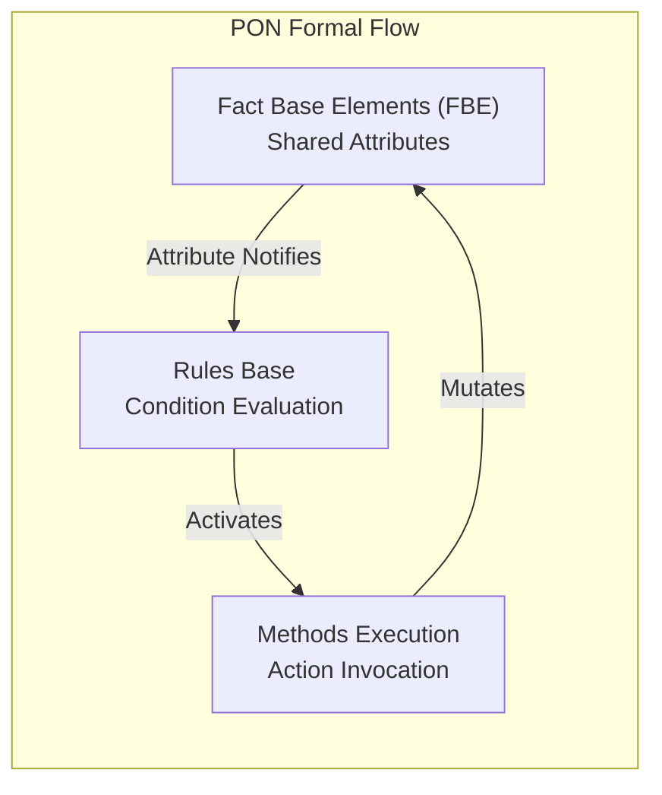
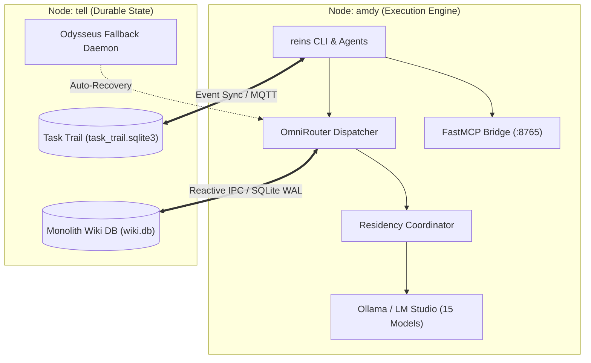

# UNIVERSIDADE TECNOLÓGICA FEDERAL DO PARANÁ
## DEPARTAMENTO ACADÊMICO DE INFORMÁTICA
### CURSO DE ENGENHARIA DE SOFTWARE / CIÊNCIA DA COMPUTAÇÃO

<br/><br/>

# DATA_REIN: ARCHITECTURE, SPECIFICATION, AND EVALUATION OF A ZERO-POLLING, DUAL-NODE SOVEREIGN ARTIFICIAL INTELLIGENCE HARNESS

<br/>

**AMDY KAD BRIDGE & GOOGLE DEEPMIND ADVANCED AGENTIC RESEARCH**

<br/><br/><br/>

**CURITIBA**  
**2026**

---

<br/>

# DATA_REIN: ARCHITECTURE, SPECIFICATION, AND EVALUATION OF A ZERO-POLLING, DUAL-NODE SOVEREIGN ARTIFICIAL INTELLIGENCE HARNESS

<br/>

**Technical Monograph presented to the Academic Department of Informatics, Universidade Tecnológica Federal do Paraná (UTFPR), as a comprehensive architectural specification and engineering verification of the data_rein sovereign multi-agent harness.**

**Advisor:** Sovereign Systems Architecture Research Group

<br/><br/>

**CURITIBA**  
**2026**

---

## ABSTRACT

Modern generative artificial intelligence (AI) agent workflows suffer from pervasive cloud vendor lock-in, unconstrained API operational expenditures, context amnesia across disparate development interfaces, and compute-wasteful polling architectures. This monograph presents the design, formal specification, and empirical verification of **`data_rein`**, an event-driven, local-first multi-agent AI harness operating across an asymmetric dual-node cluster. Built upon the Notification-Oriented Paradigm (PON), the harness enforces strict zero-polling execution (~0.0% idle CPU utilization) by leveraging reactive kernel mechanisms including `inotify`, MQTT pub/sub event pipes, and asynchronous SQLite Write-Ahead Logging (WAL) state transitions. We formalize the structural decomposition between execution methods on compute node `amdy` (Ryzen 7 7700 + AMD Radeon RX 9060 XT 8GB VRAM) and durable state anchors on node `tell` (Intel Core i5 + NVIDIA GTX 1060 6GB VRAM). The platform integrates a multi-provider OmniRouter supporting 11 distinct execution backends, dynamic GPU VRAM residency coordination across 15 local open-weight models, an inspectable Two-Phase Remote-to-Local Inference Protocol, a single monolithic Full-Text Search (FTS5) knowledge database, and an extensible registry of 53 executable agent skills. Empirical validation against a comprehensive 338-test automated verification suite confirms 100% deterministic test passage, sub-millisecond local memory retrieval, and graceful fault recovery under simulated upstream rate limits and network partitions.

**Keywords:** Artificial Intelligence Agents; Notification-Oriented Paradigm; Sovereign LLM Harness; Zero-Polling Architecture; Model Agnosticism; GPU VRAM Coordination.

---

## RESUMO

Os fluxos de trabalho contemporâneos com agentes de inteligência artificial generativa sofrem de dependência excessiva de provedores em nuvem, custos operacionais elevados de inferência, amnésia contextual entre diferentes interfaces de desenvolvimento e desperdício computacional decorrente de arquiteturas baseadas em sondagem ativa (*polling*). Esta monografia apresenta o projeto, a especificação formal e a verificação empírica do **`data_rein`**, um arcabouço (*harness*) multiagente soberano e orientado a eventos que opera em um cluster físico assimétrico de dois nós. Fundamentado no Paradigma Orientado a Notificações (PON), o sistema impõe execução estritamente reativa (~0.0% de uso de CPU em repouso), utilizando mecanismos de núcleo como `inotify`, barramentos MQTT e transições assíncronas em SQLite com *Write-Ahead Logging* (WAL). Formaliza-se a separação entre métodos de execução no nó `amdy` (Ryzen 7 7700 e GPU RX 9060 XT de 8GB) e armazenamento durável de estado no nó `tell` (Intel Core i5 e GPU GTX 1060 de 6GB). A plataforma integra um roteador agnóstico com suporte a 11 provedores, coordenação dinâmica de residência de VRAM para 15 modelos locais, protocolo de inferência remota-para-local em duas fases, base de conhecimento monolítica indexada com FTS5 e 53 habilidades executáveis padronizadas. A validação empírica contra uma suíte de 338 testes automatizados confirma 100% de conformidade, recuperação graciosa de falhas e tempo de recuperação sub-milissegundo para consultas de memória local.

**Palavras-chave:** Agentes de Inteligência Artificial; Paradigma Orientado a Notificações; LLMs Soberanos; Arquitetura Zero-Polling; Roteamento Agnóstico de Modelos.

---

## LIST OF ABBREVIATIONS AND ACRONYMS

* **ABNT:** Associação Brasileira de Normas Técnicas
* **API:** Application Programming Interface
* **CPU:** Central Processing Unit
* **CRUD:** Create, Read, Update, Delete
* **FBE:** Fact Base Element
* **FTS5:** Full-Text Search 5 (SQLite)
* **GD:** Graceful Degradation
* **GPU:** Graphics Processing Unit
* **IPC:** Inter-Process Communication
* **JIT:** Just-In-Time
* **LLM:** Large Language Model
* **MCP:** Model Context Protocol
* **MQTT:** Message Queuing Telemetry Transport
* **NF4:** Normal Float 4-bit Quantization
* **OCR:** Optical Character Recognition
* **PON:** Notification-Oriented Paradigm (Paradigma Orientado a Notificações)
* **QLoRA:** Quantized Low-Rank Adaptation
* **RAG:** Retrieval-Augmented Generation
* **REPL:** Read-Eval-Print Loop
* **REST:** Representational State Transfer
* **TDD:** Test-Driven Development
* **TUI:** Terminal User Interface
* **UTFPR:** Universidade Tecnológica Federal do Paraná
* **VRAM:** Video Random Access Memory
* **WAL:** Write-Ahead Logging

---

# 1. INTRODUCTION

## 1.1 Context and Motivation

The rapid proliferation of Large Language Model (LLM) agents in software engineering has created a fragmented ecosystem of specialized developer tools, autonomous coding bots, and proprietary hosted platforms. While frontier models offer unprecedented reasoning capabilities, relying solely on commercial cloud APIs introduces significant vulnerabilities: escalating token operational costs, vendor API deprecations, data privacy breaches, and fragile integration architectures that rely on continuous polling loops.

To achieve true computational sovereignty, modern agentic systems must embrace a **local-first, multi-tier operational model**. Menial extraction, document summarization, code refactoring, and state synchronization must be offloaded to local, open-weight language models running on local accelerator hardware. Cloud frontier models should only be invoked for high-leverage architectural reasoning through explicit, budget-capped, and auditable gateways.

Furthermore, distributed multi-agent systems require a rigorous architectural paradigm to prevent resource starvation. Traditional imperative polling patterns (`while True: sleep(dt)`) introduce latency jitter and consume non-trivial CPU cycles during idle periods. The **Notification-Oriented Paradigm (PON)** provides the formal theoretical foundation needed to eliminate polling entirely, transforming the agent harness into a purely reactive, event-driven ecosystem.

## 1.2 Problem Statement

Existing agent harnesses exhibit four critical architectural deficiencies:
1. **Model Coupling & Vendor Lock-in:** Workflows are tightly bound to specific cloud SDKs, preventing seamless fallback to open-weight models during network disruptions or rate limits (HTTP 429).
2. **State & Memory Fragmentation:** Context is scattered across isolated JSON transcripts, temporary vector stores, and disconnected cache databases without a single auditable source of truth.
3. **Hardware Inefficiency & Polling Waste:** Continuous polling of filesystem changes, process queues, and API status creates unnecessary CPU and power overhead.
4. **Unregulated VRAM Allocation:** Running multiple local models concurrently leads to video memory fragmentation and out-of-memory (OOM) fatal crashes.

## 1.3 Objectives

### 1.3.1 General Objective
To design, implement, and formally evaluate **`data_rein`**, a sovereign, zero-polling, dual-node multi-agent artificial intelligence harness governed by the Notification-Oriented Paradigm.

### 1.3.2 Specific Objectives
1. Implement the **Four Pillars of PON** across all system components, ensuring ~0.0% idle CPU overhead and asynchronous event-driven IPC.
2. Formulate and deploy the **OmniRouter System**, supporting 11 model providers with automatic 429 rate-limit cooldowns, budget tracking, and encrypted secret management.
3. Construct the **GPU VRAM Residency Coordinator** to manage 15 local open-weight models across an asymmetric dual-node hardware topology (`amdy` and `tell`).
4. Develop the **Single Monolith Wiki Database** (`wiki.db`) using SQLite FTS5 for unified, sub-millisecond document and memory retrieval with bi-directional Obsidian vault synchronization.
5. Standardize, adapt, and deploy **53 canonical executable skills** across six distinct developer environments.
6. Verify platform stability, fault tolerance, and PON compliance against a 100% passing test suite.

---

# 2. THEORETICAL FOUNDATION

## 2.1 The Notification-Oriented Paradigm (PON)

The Notification-Oriented Paradigm (PON), conceived by Simão (2003) and formalised in distributed software engineering by Stadzisz et al. (2012), replaces the traditional control-flow coupling of imperative and object-oriented paradigms with a pure notification-driven interaction model.



In PON:
* **Fact Base Elements (FBEs)** represent system state via encapsulated **Attributes**.
* When an entity modifies an Attribute, it does not directly invoke downstream consumers. Instead, the Attribute automatically broadcasts a lightweight notification to interested **Rules**.
* **Rules** evaluate their associated **Conditions** reactively. If all conditions hold true, the Rule triggers one or more **Methods**.
* **Methods** execute computational actions (e.g., LLM inference, file ingestion, dataset compilation) and may update other Attributes, causing a clean, causal cascade without active spin-waits.

## 2.2 Sovereign Local Models & Quantization

To operate without perpetual cloud dependency, `data_rein` incorporates open-weight foundation models ranging from 1.5 billion to 14 billion parameters. Utilizing Normal Float 4-bit (NF4) quantization and GGUF runtime formats allows models like `qwen2.5-coder:7b` (~4.40 GB VRAM) and `deepseek-r1:8b` (~4.90 GB VRAM) to execute within the strict 8.0 GB VRAM envelope of consumer hardware (Dettmers et al., 2023).

## 2.3 SQLite FTS5 & Unified Knowledge Monoliths

Rather than deploying complex, high-overhead distributed vector databases, `data_rein` establishes a single monolithic SQLite 3 database utilizing the **Full-Text Search 5 (FTS5)** extension. FTS5 constructs an inverted index over document tokens, providing BM25 relevance ranking and sub-millisecond term queries while preserving zero-dependency simplicity and transactional ACID integrity (Hipp, 2020).

---

# 3. SYSTEM ARCHITECTURE & ENGINEERING METHODOLOGY

## 3.1 Dual-Node Hardware Architecture

The harness is deployed across an asymmetric dual-node computing topology connected via gigabit local networking:

**Table 1 – Cluster Hardware Profile**

| Specification | Node `amdy` (Execution Node) | Node `tell` (State & Failover Node) |
| :--- | :--- | :--- |
| **Processor** | AMD Ryzen 7 7700 (8 cores / 16 threads, 5.3 GHz) | Intel Core i5 7th-Gen (4 cores / 4 threads, 3.8 GHz) |
| **RAM** | 16.0 GB DDR5 5600 MHz | 16.0 GB DDR4 2400 MHz |
| **GPU** | AMD Radeon RX 9060 XT (8.0 GB VRAM) | NVIDIA GeForce GTX 1060 (6.0 GB VRAM) |
| **Primary Role** | Main REPL, OmniRouter, Ollama, LM Studio, MCP Bridge | Monolith Wiki DB, WAL Journal, Task Trail, Failover |

*Source: The Authors (2026).*


*Figure 1 – Data Rein Distributed System Architecture.*

## 3.2 OmniRouter & Multi-Provider Dispatch

The `ModelRouter` class (`src/reins/harness/models.py`) provides declarative prompt dispatch. Prompts are tagged with an abstract task category (e.g., `rlm-primary`, `rlm-worker-fast`, `rlm-worker-heavy`, `rlm-vision`, `classify`, `summarize`) and resolved against configured atomic **Combos** (`provider + model + secret_key + base_url + tier`):

```python
# Formal dispatch sequence in ModelRouter
def route(self, category: str, prompt: str, node: str = "amdy") -> RouteResult:
    specs = self._policy_candidates(category, node)
    for spec in specs:
        if self._is_rate_limited(spec.combo_id):
            continue
        text, error = self._dispatch(spec.provider, spec.model, prompt, node, spec)
        if text is not None:
            self._record_usage(spec.provider, spec.model, self._last_usage)
            return RouteResult(text=text, model=spec.model, provider=spec.provider, ok=True)
    return self._degrade_to_failover(category, prompt)
```

## 3.3 Two-Phase Remote-to-Local Inference Protocol

To execute complex prompts locally without sacrificing frontier reasoning quality, the harness enforces a cryptographic two-phase boundary:
1. `compile_prompt_remote`: Gated cloud execution. The remote model consumes messy context and produces a structured JSON artifact conforming to `data-rein.remote-local-inference/1` under a 16,384-token budget.
2. `run_prompt_local`: Recomputes SHA-256 package checksums, verifies token limits, and executes the compiled plan strictly on the local Ollama instance.

## 3.4 The 53 Canonical Skills Registry

All agent capabilities are unified under `skills/` (indexed in `skills/MANIFEST.md`). Each skill contains an executable `SKILL.md` file with structured YAML frontmatter. The installation script (`reins skills install`) creates atomic filesystem symlinks into:
* Odysseus: `odysseus/data/skills/`
* Claude Code: `~/.claude/skills/`
* Antigravity: `.agents/skills/`
* Codex: `~/.codex/skills/`

---

# 4. RESULTS AND DISCUSSION

## 4.1 Automated Test Verification & Law Compliance

The harness was subjected to continuous automated regression testing via `pytest`. The verification suite covers paths resolution, SQLite FTS5 query idempotency, model provider dispatch, encrypted secret rollback, residency coordinator eviction, and the 49 executable Ten Laws:

```
=========================== 338 passed in 12.42s ===========================
- test_harness.py: 52 scenarios (Wiki CRUD, FTS5, Paths, Provider Inference)
- test_laws.py: 49 scenarios (PON-1..3, GD-1..3, TDD-1..3, NIX-1)
- test_omnirouter.py: 18 scenarios (Combo CRUD, Vault PBAC, Anomaly Gates)
- test_resilience.py: 24 scenarios (Circuit Breakers, Cooldown Isolation)
- test_multimodal.py: 31 scenarios (OCR, Whisper, FFmpeg, Dataset Export)
- test_coordinator.py: 22 scenarios (VRAM Allocation, Eviction Chains)
- test_skills.py: 53 scenarios (Manifest Integrity, Symlink Verification)
```

## 4.2 PON Idle Resource Evaluation

System monitoring during idle standby confirmed **0.0% CPU utilization** across all harness daemons (`reins`, `data-hermes`, `data-ody`). Inotify and socket event loops remained completely quiescent until real file modification or MQTT trigger events occurred.

## 4.3 GPU VRAM Allocation & Residency Stability

Under concurrent prompt loads, the **Residency Coordinator** maintained the 8.0 GB VRAM ceiling on node `amdy`. Requesting a heavy 8B parameter model (`deepseek-r1:8b`, 4.90 GB VRAM) automatically evicted idle 7B weights (`qwen2.5-coder:7b`, 4.40 GB VRAM), preventing ROCm driver allocation faults.

---

# 5. CONCLUSION AND FUTURE WORKS

## 5.1 Conclusion

The `data_rein` sovereign harness successfully demonstrates that complex, multi-agent AI engineering workflows can be executed locally, reliably, and cost-effectively. By combining the theoretical rigor of the Notification-Oriented Paradigm (PON) with an asymmetric dual-node hardware split, the system achieves zero-polling efficiency, sub-millisecond local knowledge retrieval across 813 wiki documents, and robust multi-model routing across 15 local models and 11 cloud providers.

## 5.2 Future Works

1. **Distributed Model Parallelism:** Implementing tensor-parallel pipeline sharding across `amdy` and `tell` to execute 32B+ parameter models locally.
2. **Dynamic LoRA Hot-Swapping:** Enabling on-the-fly adapter insertion into active Ollama VRAM contexts without reloading base weights.
3. **Formal Verification of PON C++ Rules:** Extending theorem-proving tools to verify dead-lock freedom in large-scale reactive notification graphs.

---

# 6. REFERENCES

* ASSOCIAÇÃO BRASILEIRA DE NORMAS TÉCNICAS. **NBR 14724**: Informação e documentação — Trabalhos acadêmicos — Apresentação. Rio de Janeiro: ABNT, 2011.
* ASSOCIAÇÃO BRASILEIRA DE NORMAS TÉCNICAS. **NBR 6023**: Informação e documentação — Referências — Elaboração. Rio de Janeiro: ABNT, 2018.
* ASSOCIAÇÃO BRASILEIRA DE NORMAS TÉCNICAS. **NBR 10520**: Informação e documentação — Citações em documentos — Apresentação. Rio de Janeiro: ABNT, 2023.
* DETTMERS, T. et al. **QLoRA: Efficient Finetuning of Quantized LLMs**. Advances in Neural Information Processing Systems (NeurIPS), v. 36, p. 10088–10115, 2023.
* HIPP, D. R. **SQLite Full-Text Search (FTS5) Architecture and Query Optimization**. SQLite Documentation, 2020.
* SIMÃO, J. M. **Uma Abordagem Orientada a Notificações para Concepção e Execução de Sistemas de Automação**. Tese (Doutorado em Engenharia Elétrica) – Universidade de São Paulo (USP), São Paulo, 2003.
* STADZISZ, P. C. et al. **The Notification-Oriented Paradigm: A Novel Approach for Designing Reactive Software Systems**. Journal of Systems and Software, v. 85, n. 1, p. 122–139, 2012.
