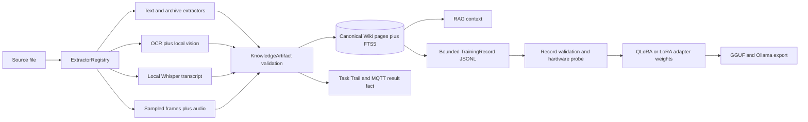

# Multimodal Knowledge and Training Pipeline

## Authority and project boundary

`data_rein` is the canonical core for extraction, permanent knowledge, RAG,
dataset derivation, and local adapter training. `/home/amdy/data-workspace` is an
operator shell and presentation layer. It consumes `data_rein` as an editable
dependency and must not copy the extractors, Wiki schema, dataset exporter, or
training loop.

The two repositories remain separate because their responsibilities differ:

| Project | Owns | Must not own |
|---|---|---|
| `data_rein` | Extractors, artifact validation, Wiki, RAG, model routing, Task Trail, training records, QLoRA/LoRA | Shell-specific GUI or OpenCode attachment behavior |
| `data-workspace` | CLI/GUI shells, Living Wiki rendering, supervisor integration, cookbook presentation | A second knowledge DB, extraction pipeline, or training implementation |

Moving a capability from `data-workspace` into `data_rein` is appropriate only
when it is core behavior useful to every shell. Physical repository merging is
not required and would weaken the ownership boundary.

## End-to-end flow



`reins.harness.digest.digest_path` is the only file-ingestion orchestrator.
The CLI and `NexusDaemon` both call it. Extractors may write temporary XML in a
bounded staging directory, but durable knowledge is written only to
`knowledge_base/wiki.db`. JSONL files and model adapters are derived artifacts;
they are never alternative knowledge stores.

## Modality behavior

| Modality | Local channels | Implementation | Graceful degradation |
|---|---|---|---|
| Text | `text` | Format-specific parsers normalize text into canonical XML | A failed file returns one `DigestItem` error without aborting the batch |
| Image | `ocr`, `visual_description` | Tesseract plus a hardware-admitted Ollama vision model selected from `model_router.json` | Either channel may survive independently; an artifact fails only when every channel is empty |
| Audio | `transcript` | `faster-whisper`, model selected by `DATA_REIN_WHISPER_MODEL` and defaulting to `tiny.en` | Missing backend or empty speech returns an explicit failed result |
| Video | `frame_ocr`, `visual_description`, `transcript` | FFmpeg samples the first frame and then at most one frame per 30 seconds; audio is converted to mono 16 kHz WAV | Missing audio does not discard visual knowledge; failed individual frame channels are recorded as warnings |
| Archive | `text` | ZIP/RAR members with supported textual formats are combined | Unreadable members degrade individually while valid members remain usable |

All inference stays local. Image descriptions use the model inventory and router
admission policy; audio uses a local Whisper model. Cloud providers are not a
fallback for extraction.

## Canonical artifact and Wiki schema

Every successful plugin result is normalized into a frozen
`KnowledgeArtifact`. Validation computes the source SHA-256 itself instead of
trusting plugin metadata. The Wiki page stores content in `pages.content` and a
JSON provenance object in `pages.metadata_json`.

Required or derived provenance fields are:

| Field | Meaning |
|---|---|
| `modality` | `text`, `image`, `audio`, `video`, or the extractor-defined modality |
| `source_sha256` | Hash of the exact source bytes used for extraction |
| `extractor` | Concrete extractor class that produced the plugin result |
| `node` | Execution node; current local multimodal extraction runs on `amdy` |
| `channels` | Successful knowledge channels in deterministic order |
| `format` | Normalized source extension or parser format |
| `frame_count` | Number of sampled video frames, zero for non-video sources |
| `duration_seconds` | Optional measured duration when available |
| `warnings` | Failed optional channels that did not invalidate the whole artifact |

Wiki schema version 2 adds `metadata_json` with an online `ALTER TABLE`
migration. Existing pages receive `{}` and remain searchable. Page slugs remain
stable, so re-digesting a changed source updates the page rather than duplicating
knowledge.

## Context path

RAG reads the Wiki, not extracted XML or training JSONL. A workflow invoked with
RAG enabled searches pages and memories, selects bounded snippets, and prepends
them to the local model prompt. This path changes model context for the current
request; it does not change weights.

Use:

```bash
reins digest /path/to/source --recursive
reins wiki search "source provenance"
reins run "rag extraction" "question" --rag
```

Directory ingestion ignores unsupported runtime artifacts such as SQLite WAL
files. Direct ingestion of an unsupported file still returns a clear failed
result.

## Weight-manipulation path

Training is deliberately separated into derived-data preparation, preflight,
weight updates, and export:

```bash
reins dataset export /path/to/train.jsonl --max-chars 8192
reins train run --dataset /path/to/train.jsonl --dry-run
uv sync --extra train
reins train run --dataset /path/to/train.jsonl --name knowledge-adapter-v1
reins train export /path/to/run knowledge-adapter:latest
```

`export_jsonl` segments long pages before tokenization. It never emits a single
oversized page that the tokenizer silently truncates. Each `TrainingRecord`
retains `source_sha256`, modality, extractor, channels, source path, Wiki slug,
and zero-based `segment_index` plus `segment_count`.

`run_finetune` validates every JSONL line before unloading resident models or
loading a base model. Hardware capability chooses the best honest backend:

1. NF4 QLoRA when a usable GPU and bitsandbytes are present.
2. FP16/BF16 LoRA when a GPU is usable without bitsandbytes.
3. CPU LoRA with the configured tiny base model when Torch/GPU support is absent.

One out-of-memory failure halves batch/sequence pressure and retries once. Any
other failure produces `TrainResult(ok=False)`, records the failure in the Task
Trail, and leaves the harness running.

The `media` optional dependency is independent of `train`: a node can extract
audio without installing the much larger model-training stack.

## Model behavior contract

Models using or extending this pipeline must preserve these rules:

1. Treat the Wiki as the only permanent knowledge authority.
2. Enter file knowledge through `digest_path`; do not call an extractor and
   invent a second persistence flow.
3. Validate untrusted file, MQTT, SQLite JSON, Ollama, and training boundaries
   with typed schemas.
4. Preserve source hashes and channel provenance through every derived artifact.
5. Route sensitive extraction locally and require explicit authorization for
   unrelated cloud inference.
6. React to file/MQTT notifications; never add periodic polling.
7. Degrade per channel or per file and publish an honest diagnostic.
8. Validate training records before any model residency or weight state changes.
9. Keep `data-workspace` thin; core behavior belongs in `data_rein`.
10. Add Given/When/Then regression coverage for every changed behavioral boundary.

## Verification evidence

On 2026-08-13 the live CLI ingested generated fixtures through real local tools:

| Source | Observed Wiki result |
|---|---|
| PNG containing `CANONICAL WIKI / SOURCE PROVENANCE` | OCR recovered both lines; `bakllava:latest` added a visual description |
| ALSA `Front_Center.wav` | local `tiny.en` Whisper produced `front, center.` |
| H.264/AAC video made from both fixtures | one PNG frame produced OCR plus vision; extracted WAV produced the transcript |

The three pages exported to five 128-character records with stable hashes and
segment coordinates. Training dry-run validated all five records and honestly
reported CPU LoRA because the optional Torch training extra was not installed.

## Primary implementation files

- `src/reins/extraction/artifacts.py`: validated artifact and source hashing.
- `src/reins/extraction/extractors/media_extractors.py`: local image/audio/video channels.
- `src/reins/extraction/vision.py`: hardware-admitted Ollama vision request.
- `src/reins/harness/digest.py`: canonical orchestration and PON notification.
- `src/reins/harness/wiki.py`: schema v2, FTS, pages, and memories.
- `src/reins/harness/dataset.py`: Wiki-to-JSONL derivation and segmentation.
- `src/reins/training/records.py`: training schemas and pre-model validation.
- `src/reins/training/config.py`: hardware-bounded training configuration.
- `src/reins/training/qlora.py`: residency, degradation, and Task Trail orchestration.
- `src/reins/training/transformers_backend.py`: optional Transformers/PEFT weight update.
- `src/reins/services/data_nexus/nexus_daemon.py`: MQTT-to-digest bridge.
