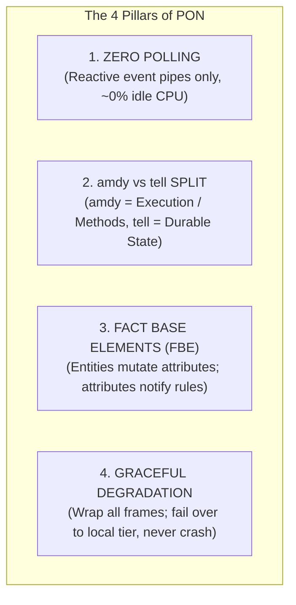
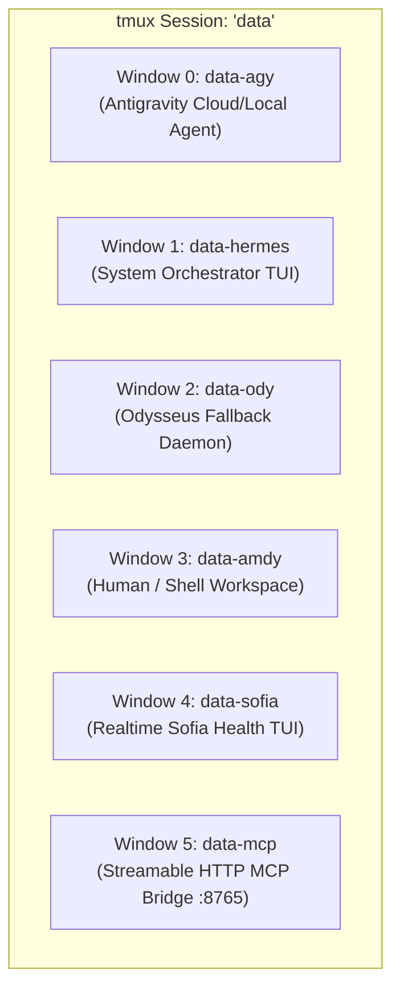
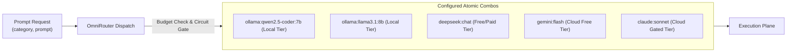
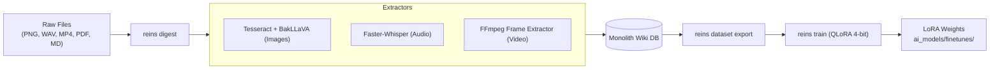

# // DATA_REIN SOVEREIGN HARNESS: EXHAUSTIVE USER MANUAL
## The Definitive Operational Handbook for Sovereign AI Systems Engineering

> **Author:** Antigravity / DeepMind Autonomous Agent Architecture  
> **Constitutional Binding:** `knowledge_base/PRIME_DIRECTIVE.md`  
> **Aesthetic Directive:** Omarchy Cyberpunk (`#ff4040` True Blood Red on `#200000` Deep Blood Black)  
> **Repository Root:** `/home/amdy/data_rein`  
> **Test Status:** 338/338 Tests Passing (100% Green)

---

```
  ██████╗  █████╗ ████████╗ █████╗     ██████╗ ███████╗██╗███╗   ██╗
  ██╔══██╗██╔══██╗╚══██╔══╝██╔══██╗    ██╔══██╗██╔════╝██║████╗  ██║
  ██║  ██║███████║   ██║   ███████║    ██████╔╝█████╗  ██║██╔██╗ ██║
  ██║  ██║██╔══██║   ██║   ██╔══██║    ██╔══██╗██╔══╝  ██║██║╚██╗██║
  ██████╔╝██║  ██║   ██║   ██║  ██║    ██║  ██║███████╗██║██║ ╚████║
  ╚═════╝ ╚═╝  ╚═╝   ╚═╝   ╚═╝  ╚═╝    ╚═╝  ╚═╝╚══════╝╚═╝╚═╝  ╚═══╝
  [ SOVEREIGN DUAL-NODE MULTI-AGENT AI HARNESS · ZERO-POLLING EVENT REPL ]
```

---

## 📑 TABLE OF CONTENTS

1. [Executive Summary: What is Data Rein?](#1-executive-summary-what-is-data-rein)
2. [The Architectural Religion: The Notification-Oriented Paradigm (PON)](#2-the-architectural-religion-the-notification-oriented-paradigm-pon)
3. [Dual-Node Hardware Topology (`amdy` vs `tell`)](#3-dual-node-hardware-topology-amdy-vs-tell)
4. [The Agent Armada & The 6-Window Tmux Matrix](#4-the-agent-armada--the-6-window-tmux-matrix)
5. [The 53 Canonical Skills Encyclopedia](#5-the-53-canonical-skills-encyclopedia)
6. [OmniRouter System: 11 Providers, Combos & Encrypted Vault](#6-omnirouter-system-11-providers-combos--encrypted-vault)
7. [The 15-Model Local Zoo & GPU VRAM Residency Coordinator](#7-the-15-model-local-zoo--gpu-vram-residency-coordinator)
8. [Two-Phase Remote-to-Local Inference Protocol](#8-two-phase-remote-to-local-inference-protocol)
9. [The Monolith Wiki DB & Obsidian Vault Ecosystem](#9-the-monolith-wiki-db--obsidian-vault-ecosystem)
10. [The Universal Task Trail & State Machine](#10-the-universal-task-trail--state-machine)
11. [Multimodal Knowledge Ingestion & Local QLoRA Fine-Tuning](#11-multimodal-knowledge-ingestion--local-qlora-fine-tuning)
12. [Master CLI (`reins`) & MCP Tool Reference](#12-master-cli-reins--mcp-tool-reference)
13. [Zero-to-Hero Tutorial: Your First 10 Minutes](#13-zero-to-hero-tutorial-your-first-10-minutes)
14. [Troubleshooting, Circuit Breakers & Self-Healing](#14-troubleshooting-circuit-breakers--self-healing)

---

## 1. EXECUTIVE SUMMARY: WHAT IS DATA REIN?

If you are reading this manual, welcome to the command center of **`data_rein`**. 

Modern AI development is plagued by three fatal bottlenecks:
1. **Cloud Vendor Lock-In & Astronomical Token Invoices:** Sending trivial summarization, classification, and formatting prompts to $20/million-token cloud models.
2. **Context Amnesia:** Every AI session starts from scratch, losing memory of past architecture decisions, bug diagnoses, and domain vocabulary.
3. **Fragile, Resource-Wasting Architecture:** Systems built on polling loops (`while True: sleep(1)`) that peg CPU cores, drop network packets, and crash when an API returns HTTP 429.

**`data_rein` solves all three forever.**

It is a sovereign, self-contained AI operating harness. It connects multiple intelligence front-ends (Antigravity, OpenCode, Claude Code, Codex, Hermes, Odysseus) to a single monolithic knowledge store (`knowledge_base/wiki.db`), routes prompts intelligently between 15 local open-weight models and 11 cloud backends, and enforces the zero-polling Notification-Oriented Paradigm (PON).

```
┌─────────────────────────────────────────────────────────────────────────────┐
│                             THE DATA_REIN TRINITY                           │
├──────────────────────────┬──────────────────────────┬───────────────────────┤
│ ONE SHARED MONOLITH      │ ANY INTELLIGENCE MODEL   │ EVENT-DRIVEN PON      │
│ Single wiki DB (FTS5)    │ 11 backends, local-first │ Zero-polling, reactive│
│ 813 pages, 171 memories  │ multi-tier auto-failover │ ~0.0% idle CPU cost   │
└──────────────────────────┴──────────────────────────┴───────────────────────┘
```

---

## 2. THE ARCHITECTURAL RELIGION: THE NOTIFICATION-ORIENTED PARADIGM (PON)

All software written within this repository must adhere to the **Four Pillars of PON** (`knowledge_base/PRIME_DIRECTIVE.md` and `skills/agy-pon-compliance/SKILL.md`):



### 1. Zero Polling
* **The Rule:** No `while True: sleep()`, no HTTP readiness spin-loops, no cron busy-waits.
* **The Implementation:** Services wait on blocking kernel mechanisms: `inotify`, MQTT subscriptions (`data_rein/#`), Unix domain sockets (`~/.config/data_nexus/reins_ipc.sock`), or SQLite WAL notifications. Idle CPU utilization across all harness daemons must remain ~0.0%.

### 2. Strict Role Separation (`amdy` vs `tell`)
* **`amdy` = Execution Engine (Methods):** Compute, LLM inference, REPL commands, and active code synthesis run on `amdy`.
* **`tell` = State Anchor (Fact Base):** Durable storage, SQLite database WAL journals, backups, and long-term memory reside on `tell`. Execution nodes wake only when notified by state changes.

### 3. Fact Base Elements (FBE)
* In object-oriented programming, entities chain-call each other directly (`A.doSomething(B)`).
* In PON, entities mutate **Attributes** in the Fact Base. Changing an attribute fires a reactive notification to **Rules**, which evaluate conditions and invoke **Methods**. Decoupling is 100% complete.

### 4. Graceful Degradation (GD)
* If an API endpoint fails, an upstream server returns HTTP 429, or a network interface disconnects, the harness **never throws an unhandled crash to the user**.
* It catches the error, marks the provider's **Circuit Breaker** as `OPEN`, degrades to the next candidate model in the category combo list, logs a structured diagnostic to the Task Trail, and returns an honest `RouteResult(ok=False, error=...)`.

---

## 3. DUAL-NODE HARDWARE TOPOLOGY (`amdy` vs `tell`)

The physical infrastructure is automatically profiled into `knowledge_base/HARDWARE.md` by `reins.services.sys_profiler`:

```
┌─────────────────────────────────────────────────────────────────────────────┐
│                           CLUSTER HARDWARE PROFILE                          │
├──────────────────────────────────────┬──────────────────────────────────────┤
│ NODE: amdy (Execution Engine)        │ NODE: tell (Durable State & Storage) │
├──────────────────────────────────────┼──────────────────────────────────────┤
│ • CPU: AMD Ryzen 7 7700 (8c / 16t)   │ • CPU: Intel Core i5 7th-Gen (4c/4t) │
│ • GPU: AMD Radeon RX 9060 XT (8GB)   │ • GPU: NVIDIA GeForce GTX 1060 (6GB) │
│ • RAM: 16.0 GB DDR5                  │ • RAM: 16.0 GB DDR4                  │
│ • Role: Ollama, LM Studio, REPL,     │ • Role: Monolith Wiki DB, WAL journal│
│   OmniRouter, Antigravity, OpenCode  │   Task Trail sync, failover Ollama   │
└──────────────────────────────────────┴──────────────────────────────────────┘
```

> [!IMPORTANT]
> The **Model Residency Coordinator** (`reins.harness.coordinator`) actively monitors the 8.0 GB VRAM ceiling on `amdy`. It dynamically unloads idle model weights before loading new models, ensuring zero CUDA/ROCm out-of-memory errors.

---

## 4. THE AGENT ARMADA & THE 6-WINDOW TMUX MATRIX

All continuous background daemons, monitoring TUIs, and agent interfaces run inside a persistent, self-healing `tmux` session named `data` (launched via `data-harness-daemon.sh`):



### Window Directory:

1. **`data-agy`**: Antigravity interactive CLI with bypassed sandbox and full sudo privileges for rapid system engineering.
2. **`data-hermes`**: Hermes Orchestrator running local models (`qwen2.5-coder:7b`) for autonomous task scheduling.
3. **`data-ody`**: Odysseus autonomous daemon. Monitors `task_trail.sqlite3` and claims failed background tasks for automatic local recovery.
4. **`data-amdy`**: General terminal for the human operator.
5. **`data-sofia`**: Sofia Protocol realtime TUI dashboard displaying process tree, hardware thermals/VRAM, Task Trail status, and circuit breaker metrics.
6. **`data-mcp`**: Supervised Streamable HTTP/stdio MCP Bridge (`127.0.0.1:8765`) exposing 24+ tools to external agents (OpenCode, Codex, VS Code).

---

## 5. THE 53 CANONICAL SKILLS ENCYCLOPEDIA

All 53 skills reside in `skills/` (indexed by `skills/MANIFEST.md`). They are symlinked across all 6 agent environments via `reins skills install`:

```
┌─────────────────────────────────────────────────────────────────────────────┐
│                      THE 53 CANONICAL HARNESS SKILLS                        │
└─────────────────────────────────────────────────────────────────────────────┘
```

### Category 1: Harness Core & PON Architecture (7 Skills)
* [`data_rein`](file:///home/amdy/data_rein/skills/data_rein/SKILL.md): Universal entry skill. Enforces mandatory boot memory sync, reads `PRIME_DIRECTIVE.md`, and validates system paths.
* [`agy-pon-compliance`](file:///home/amdy/data_rein/skills/agy-pon-compliance/SKILL.md): The PON architectural law. Enforces zero polling, async event queues, and amdy/tell separation.
* [`kad_pon`](file:///home/amdy/data_rein/skills/kad_pon/SKILL.md): Reactive C++ PON engine bindings (`SharedAttribute`, `Rule`, `inotify`, MQTT pipelines).
* [`hermes-persona`](file:///home/amdy/data_rein/skills/hermes-persona/SKILL.md): Data-Hermes synthetic orchestrator persona: concise, tactical, uncompromising, and highly effective.
* [`omarchy-aesthetics`](file:///home/amdy/data_rein/skills/omarchy-aesthetics/SKILL.md): Omarchy Cyberpunk UI directive: True Blood Red (`#ff4040`) on Deep Blood Black (`#200000`), 50px pill rounding, and glassmorphism.
* [`pon_testing_suite`](file:///home/amdy/data_rein/skills/pon_testing_suite/SKILL.md): Automated static-analysis test gate wired into `.git/hooks/pre-push`.
* [`prompt-optimizer`](file:///home/amdy/data_rein/skills/prompt-optimizer/SKILL.md): Two-phase remote prompt compilation (`compile_prompt_remote`) and bounded local execution.

### Category 2: Engineering, Testing & TDD (15 Skills)
* [`tdd`](file:///home/amdy/data_rein/skills/tdd/SKILL.md): Test-Driven Development workflow: Red-Green-Refactor with isolated mocks.
* [`code-review`](file:///home/amdy/data_rein/skills/code-review/SKILL.md): Two-axis parallel code review (Standards Compliance vs Feature Spec).
* [`diagnosing-bugs`](file:///home/amdy/data_rein/skills/diagnosing-bugs/SKILL.md): Scientific root-cause debugging loop for hard crashes and regressions.
* [`implement`](file:///home/amdy/data_rein/skills/implement/SKILL.md): Precision implementation engine ensuring strict test-first progress.
* [`prototype`](file:///home/amdy/data_rein/skills/prototype/SKILL.md): Rapid throwaway prototype generation to test interface hypotheses.
* [`qa`](file:///home/amdy/data_rein/skills/qa/SKILL.md): Interactive conversational QA session generating reproducible bug tickets.
* [`request-refactor-plan`](file:///home/amdy/data_rein/skills/request-refactor-plan/SKILL.md): Generates atomic refactor plans structured as tiny, safe commits.
* [`resolving-merge-conflicts`](file:///home/amdy/data_rein/skills/resolving-merge-conflicts/SKILL.md): Systematic conflict resolution for complex git merges and rebases.
* [`git-guardrails-claude-code`](file:///home/amdy/data_rein/skills/git-guardrails-claude-code/SKILL.md): Safety hooks intercepting dangerous git operations (`push`, `reset --hard`, `clean`).
* [`migrate-to-shoehorn`](file:///home/amdy/data_rein/skills/migrate-to-shoehorn/SKILL.md): Replaces unsafe `as` type assertions with `@total-typescript/shoehorn`.
* [`setup-pre-commit`](file:///home/amdy/data_rein/skills/setup-pre-commit/SKILL.md): Sets up Husky pre-commit hooks with lint-staged, Prettier, and test gates.
* [`scaffold-exercises`](file:///home/amdy/data_rein/skills/scaffold-exercises/SKILL.md): Generates educational coding exercises with tests and explainers.
* [`to-spec`](file:///home/amdy/data_rein/skills/to-spec/SKILL.md): Transforms rough concepts into rigorous technical specifications.
* [`to-tickets`](file:///home/amdy/data_rein/skills/to-tickets/SKILL.md): Decomposes specifications into bite-sized implementation issues.
* [`triage`](file:///home/amdy/data_rein/skills/triage/SKILL.md): Quickly prioritizes bugs, error traces, and feature backlogs.

### Category 3: System Architecture & Design (8 Skills)
* [`archify`](file:///home/amdy/data_rein/skills/archify/SKILL.md): Standalone interactive HTML/SVG system architecture, sequence, and data flow generator.
* [`codebase-design`](file:///home/amdy/data_rein/skills/codebase-design/SKILL.md): Principles for deep module boundaries and AI-navigable code.
* [`domain-modeling`](file:///home/amdy/data_rein/skills/domain-modeling/SKILL.md): Builds and maintains ubiquitous domain language and architectural records.
* [`design-an-interface`](file:///home/amdy/data_rein/skills/design-an-interface/SKILL.md): Generates contrasting interface designs to compare module shapes.
* [`improve-codebase-architecture`](file:///home/amdy/data_rein/skills/improve-codebase-architecture/SKILL.md): Identifies and eliminates circular dependencies and architectural rot.
* [`setup-ts-deep-modules`](file:///home/amdy/data_rein/skills/setup-ts-deep-modules/SKILL.md): Sets up encapsulated TypeScript modules with minimal public surfaces.
* [`ubiquitous-language`](file:///home/amdy/data_rein/skills/ubiquitous-language/SKILL.md): Standardizes domain glossaries across cross-functional modules.
* [`wayfinder`](file:///home/amdy/data_rein/skills/wayfinder/SKILL.md): Maps execution flows and codebase caller/callee graphs.

### Category 4: Productivity, Writing & Knowledge Ingestion (23 Skills)
* [`deep-research-paper`](file:///home/amdy/data_rein/skills/deep-research-paper/SKILL.md): Modular academic paper writing engine enforcing Plan-Draft-Revise.
* [`utfpr-tcc-abnt`](file:///home/amdy/data_rein/skills/utfpr-tcc-abnt/SKILL.md): Strict UTFPR / ABNT standard formatting for monographs and theses.
* [`book-to-skill`](file:///home/amdy/data_rein/skills/book-to-skill/SKILL.md): Transforms PDF/EPUB/DOCX books into executable agent skills.
* [`obsidian-vault`](file:///home/amdy/data_rein/skills/obsidian-vault/SKILL.md): Searches, creates, and indexes notes in the Obsidian vault.
* [`research`](file:///home/amdy/data_rein/skills/research/SKILL.md): Investigates technical questions against primary sources and outputs markdown findings.
* [`grilling`](file:///home/amdy/data_rein/skills/grilling/SKILL.md): Relentlessly stress-tests and grills plans before implementation.
* [`grill-me`](file:///home/amdy/data_rein/skills/grill-me/SKILL.md): Interactive user interview to resolve ambiguous requirements.
* [`grill-with-docs`](file:///home/amdy/data_rein/skills/grill-with-docs/SKILL.md): Validates software designs against official documentation.
* [`handoff`](file:///home/amdy/data_rein/skills/handoff/SKILL.md): Prepares structured context handoffs for subsequent agent sessions.
* [`claude-handoff`](file:///home/amdy/data_rein/skills/claude-handoff/SKILL.md): Session continuity packaging tailored for Claude Code.
* [`loop-me`](file:///home/amdy/data_rein/skills/loop-me/SKILL.md): Continuous iteration and automated refinement loop.
* [`teach`](file:///home/amdy/data_rein/skills/teach/SKILL.md): Pedagogical mode explaining complex topics through first-principles analogies.
* [`to-questionnaire`](file:///home/amdy/data_rein/skills/to-questionnaire/SKILL.md): Converts vague requirements into multiple-choice discovery questions.
* [`wait-what`](file:///home/amdy/data_rein/skills/wait-what/SKILL.md): Clarification mode uncovering hidden assumptions and missing edge cases.
* [`wizard`](file:///home/amdy/data_rein/skills/wizard/SKILL.md): Multi-step setup wizard for complex toolchain configurations.
* [`writing-beats`](file:///home/amdy/data_rein/skills/writing-beats/SKILL.md): Outlines long-form writing into narrative beats and logical arguments.
* [`writing-for-agents`](file:///home/amdy/data_rein/skills/writing-for-agents/SKILL.md): Optimizes documentation and error messages for consumption by AI models.
* [`writing-fragments`](file:///home/amdy/data_rein/skills/writing-fragments/SKILL.md): Composes modular documentation fragments for easy reuse.
* [`writing-great-skills`](file:///home/amdy/data_rein/skills/writing-great-skills/SKILL.md): Authoring guide for building powerful executable agent skills.
* [`writing-shape`](file:///home/amdy/data_rein/skills/writing-shape/SKILL.md): Visualizes and polishes macro structure of articles and reports.
* [`ask-matt`](file:///home/amdy/data_rein/skills/ask-matt/SKILL.md): Consults Matt Pocock's TypeScript and API design mental models.
* [`setup-matt-pocock-skills`](file:///home/amdy/data_rein/skills/setup-matt-pocock-skills/SKILL.md): Manages and verifies Matt Pocock skill suite installations.
* [`edit-article`](file:///home/amdy/data_rein/skills/edit-article/SKILL.md): Editorial review and polish for technical blog posts and documentation.

---

## 6. OMNIROUTER SYSTEM: 11 PROVIDERS, COMBOS & ENCRYPTED VAULT

The `ModelRouter` (`src/reins/harness/models.py`) routes tasks by **Category Archetype** rather than hardcoded model names. It is configured through **Combos** in `config/omnirouter.json`:



### The 11 Model Providers:
1. **Ollama:** Local zero-cost inference for 15 installed models (`127.0.0.1:11434`).
2. **LM Studio:** Local JIT-loaded Qwen 2.5 Coder 7B for OpenCode (`127.0.0.1:1234`).
3. **Google Gemini:** Gemini 2.0 Flash / Gemini 2.0 Pro.
4. **Anthropic Claude:** Claude 3.7 Sonnet / Haiku (Explicit cloud escalation only).
5. **OpenAI:** GPT-4o, GPT-4o-mini, o3-mini.
6. **DeepSeek:** DeepSeek-V3 and DeepSeek-R1 via OpenAI-compatible endpoints.
7. **xAI (Grok):** Grok-3 / Grok-3-mini.
8. **Moonshot (Kimi):** Moonshot-v1 models for long-context reasoning.
9. **ZhipuAI (GLM):** GLM-4-Flash for lightweight structured workers.
10. **OpenRouter:** Universal multi-vendor aggregator with strict budget caps.
11. **ComfyUI:** Local image/diagram generation and audio pipelines.

### Secret Vault Management (`reins secret`):
Secrets are stored in an encrypted Fernet vault (`.secrets.enc`) with automated `.secrets.enc.bak` rollback:

```bash
reins secret list                     # List all encrypted keys
reins secret set DEEPSEEK_API_KEY sk-*** # Add/update an API key
reins secret get GEMINI_API_KEY       # Test key decryption
```

---

## 7. THE 15-MODEL LOCAL ZOO & GPU VRAM RESIDENCY COORDINATOR

The local cluster serves 15 open-weight models on demand. Models are dynamically loaded into the 8GB RX 9060 XT VRAM pool on `amdy`:

```
┌─────────────────────────────────────────────────────────────────────────────┐
│                       LOCAL MODEL FLEET (15 MODELS)                         │
├───────────────────────┬────────────┬─────────────┬──────────────────────────┤
│ Model Name            │ Parameter  │ VRAM Footprint│ Primary Strengths       │
├───────────────────────┼────────────┼─────────────┼──────────────────────────┤
│ qwen2.5-coder:7b      │ 7 Billion  │ ~4.40 GB    │ Sovereign code synthesis │
│ llama3.1:8b           │ 8 Billion  │ ~4.65 GB    │ Robust general agent     │
│ deepseek-r1:8b        │ 8 Billion  │ ~4.90 GB    │ Local chain-of-thought   │
│ deepseek-r1:14b       │ 14 Billion │ ~8.20 GB    │ Heavy math & logic       │
│ gemma3:4b             │ 4 Billion  │ ~2.80 GB    │ Fast compact reasoning   │
│ qwen2.5-coder:1.5b    │ 1.5 Billion│ ~1.20 GB    │ Ultra-fast extraction    │
│ deepseek-r1:1.5b      │ 1.5 Billion│ ~1.10 GB    │ Fast reasoning worker    │
│ bakllava:latest       │ 7 Billion  │ ~4.50 GB    │ Local image OCR & vision │
│ moondream:1.8b        │ 1.8 Billion│ ~1.40 GB    │ Lightweight image vision │
│ phi4-mini:latest      │ 3.8 Billion│ ~2.50 GB    │ Logic classification     │
│ phi3.5:3.8b           │ 3.8 Billion│ ~2.40 GB    │ Instruction following    │
│ llama3.2:3b           │ 3 Billion  │ ~2.00 GB    │ Compact worker           │
│ qwen3.5:9b            │ 9 Billion  │ ~5.40 GB    │ Multi-turn dialogue      │
│ qwen3:8b              │ 8 Billion  │ ~4.80 GB    │ High-context retrieval   │
│ codegemma:7b          │ 7 Billion  │ ~4.50 GB    │ Code completion          │
└───────────────────────┴────────────┴─────────────┴──────────────────────────┘
```

### GPU VRAM Residency Coordinator (`reins coord`):
```bash
reins coord status             # View current GPU VRAM allocation (e.g. 4.65/7.2 GB)
reins coord unload llama3.1:8b # Evict model weights from GPU memory
reins coord load qwen2.5-coder:7b # Pre-warm model into VRAM
```

---

## 8. TWO-PHASE REMOTE-TO-LOCAL INFERENCE PROTOCOL

When a task requires deep frontier reasoning but must execute locally, `data_rein` uses an inspectable Two-Phase Inference Protocol (`skills/prompt-optimizer/SKILL.md`):

1. **Phase 1: `compile_prompt_remote` (Cloud Gated)**  
   An authorized cloud model (e.g. Gemini 2.0 or Claude 3.7) compresses the messy input context, resolves invariants, and outputs a strict JSON package conforming to the `data-rein.remote-local-inference/1` schema (capped at 16,384 tokens).
2. **Phase 2: `run_prompt_local` (Local Only)**  
   Validates the SHA-256 package hash, checks token boundaries, and executes the compiled prompt strictly on a local model (e.g. `qwen2.5-coder:7b` on `amdy`). No cloud requests occur during Phase 2.

---

## 9. THE MONOLITH WIKI DB & OBSIDIAN VAULT ECOSYSTEM

There is exactly **one** unified knowledge database: **`knowledge_base/wiki.db`**.

* **Content:** 813 Markdown pages and 171 atomic memories across 68 categories.
* **Search:** Full-text SQLite FTS5 index with instantaneous sub-millisecond retrieval.
* **Obsidian Mirror:** Automatically synced to `wiki_vault/` and `data-oby/` as clean `.md` files with rich YAML frontmatter (`slug`, `category`, `owner`, `uid`).

```bash
reins wiki stats                  # Show total page and memory counts
reins wiki search "PON"           # Instant FTS5 full-text search
reins wiki get pon                # Fetch Markdown article content
reins wiki add-memory "fact..."   # Add atomic memory to Ody Vault
reins wiki consolidate            # Idempotent rebuild from all sources
```

---

## 10. THE UNIVERSAL TASK TRAIL & STATE MACHINE

All agents coordinate through `~/.config/data_nexus/task_trail.sqlite3` (`reins.harness.paths.task_trail`):

* **State Machine:** Tasks transition through `pending` ➔ `running` ➔ `success` / `failed`.
* **Rule of Awareness:** Before starting a complex action, an agent inspects `reins trail list` to avoid duplicate work.
* **Autonomous Fallback:** If a local task fails, `data-ody` detects the failed record and automatically attempts secondary recovery.

---

## 11. MULTIMODAL KNOWLEDGE INGESTION & LOCAL QLORA FINE-TUNING

`data_rein` provides a complete local pipeline for multimodal knowledge extraction and continuous model fine-tuning:



```bash
# Ingest image diagram into Wiki with OCR and Vision analysis:
reins digest /path/to/architecture.png

# Ingest audio recording into Wiki with speech-to-text:
reins digest /path/to/meeting.wav

# Export training dataset from digested wiki pages:
reins dataset export --output training_data.jsonl

# Fine-tune a local model with 4-bit NF4 QLoRA on GPU:
reins train --data training_data.jsonl --model qwen2.5-coder:7b
```

---

## 12. MASTER CLI (`reins`) & MCP TOOL REFERENCE

The `reins` executable is available globally at `~/.local/bin/reins`:

### Complete CLI Command Reference:

| Command | Category | Description | Example |
| :--- | :--- | :--- | :--- |
| `reins paths` | System | Print canonical paths (wiki, vault, config) | `reins paths` |
| `reins directive` | Constitution| Print the Prime Directive master law | `reins directive` |
| `reins skills list` | Skills | List all 53 registered canonical skills | `reins skills list` |
| `reins skills install`| Skills | Symlink skills into all 6 agent environments | `reins skills install` |
| `reins bin list` | Binaries | List commands linked onto `$PATH` | `reins bin list` |
| `reins wiki stats` | Wiki | Display total pages, memories, and categories | `reins wiki stats` |
| `reins wiki search` | Wiki | FTS5 full-text search across all knowledge | `reins wiki search "PON"` |
| `reins wiki get` | Wiki | Output full markdown content of a page | `reins wiki get pon` |
| `reins wiki add-memory`| Wiki | Add persistent fact to Memory Vault | `reins wiki add-memory "Fact" -c system` |
| `reins combos list` | Routing | List all 19 model combos, tiers, and keys | `reins combos list` |
| `reins local status` | Local AI | Check Ollama and LM Studio server health | `reins local status` |
| `reins local list` | Local AI | List all 15 installed local models | `reins local list` |
| `reins coord status` | VRAM | Check GPU VRAM residency (4.65/7.2 GB) | `reins coord status` |
| `reins run` | Inference | Route prompt to category's optimal combo | `reins run rlm-primary "Write async code"`|
| `reins ask` | Inference | Quick question to lightweight local model | `reins ask "Explain PON in 1 sentence"` |
| `reins summarize` | Inference | Condense document or piped stdin | `reins summarize README.md` |
| `reins classify` | Inference | Categorize text using local classifier | `reins classify "Bug report: OOM crash"` |
| `reins batch` | Inference | Process prompts in bulk from file | `reins batch rlm-worker-fast prompts.txt`|
| `reins digest` | Multimodal | Extract text/audio/video into Wiki DB | `reins digest diagram.png` |
| `reins dataset export`| Training | Export segmented training dataset from Wiki | `reins dataset export -o train.jsonl` |
| `reins train` | Training | Run local QLoRA 4-bit fine-tuning | `reins train -d train.jsonl -m qwen2.5-coder:7b` |
| `reins secret list` | Security | List stored encrypted secrets in vault | `reins secret list` |
| `reins secret set` | Security | Store encrypted API key in vault | `reins secret set DEEPSEEK_API_KEY sk-...`|
| `reins tokens status`| Quota | Show token usage vs 5h/day/week budgets | `reins tokens status` |
| `reins trail list` | Task Trail | View active and completed task history | `reins trail list` |

---

## 13. ZERO-TO-HERO TUTORIAL: YOUR FIRST 10 MINUTES

Follow this hands-on tutorial to master the harness in 5 simple steps:

### Step 1: Health & Memory Verification
Open your terminal and verify that all nodes and local models are active:
```bash
reins local status
reins coord status
reins wiki stats
```

### Step 2: Querying the Monolith Wiki
Search for existing architecture decisions:
```bash
reins wiki search "graceful degradation"
reins wiki get pon
```

### Step 3: Fast Zero-Cost Local Inference
Ask a fast question to a local model without spending any cloud credits:
```bash
reins ask "What are the four pillars of the Notification-Oriented Paradigm?"
```

### Step 4: Adding Persistent Memory to the Vault
Store a persistent fact that every future agent session will remember:
```bash
reins wiki add-memory "The unified manual guide was compiled on 2026-08-15" --category changelog
```

### Step 5: Routing by Task Category
Run a code generation task routed to the optimal combo:
```bash
reins run "rlm-primary" "Write a Python async queue worker that complies with zero-polling PON."
```

---

## 14. TROUBLESHOOTING, CIRCUIT BREAKERS & SELF-HEALING

| Symptom | Cause | Automated Recovery / Solution |
| :--- | :--- | :--- |
| `CircuitOpenError: circuit '...' is open` | A model failed repeatedly, opening breaker | Breaker resets automatically after 30s. Verify local Ollama service with `reins local status`. |
| `SkillRegistryError` | Missing `SKILL.md` in a skills subfolder | Ensure `skills/<name>/SKILL.md` exists with frontmatter. Run `reins skills list`. |
| `RateLimitError (429)` | Cloud provider hit API quota limit | OmniRouter automatically cools down that combo for 300s and falls back to local candidates. |
| `VRAM Out of Memory` | Too many weights resident in GPU | Run `reins coord unload <model>` to clear stale weights from VRAM. |
| `Vault Decryption Error` | Missing or corrupted `.secrets.enc` | Restore key or set key with `reins secret set <KEY> <VALUE>`. Backup is in `.secrets.enc.bak`. |

---

> **END OF MANUAL** · `data_rein` Sovereign AI Harness  
> *Sync first · One wiki · Any model · Zero polling · Degrade, never crash.*
